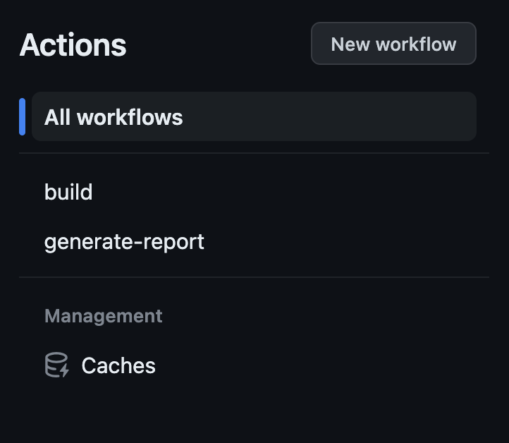
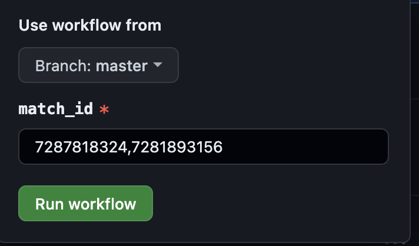
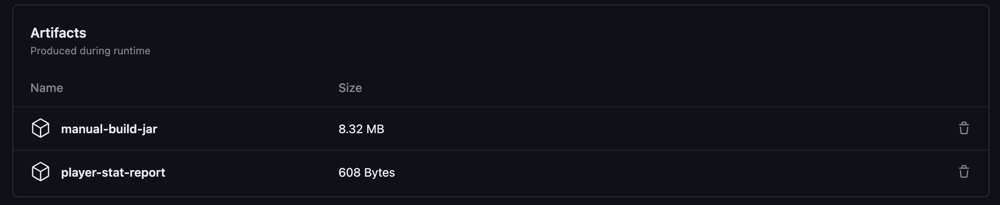

# Match Parser for Invicible Dota 2 Lobay

[](https://github.com/qornanali/inv-liga-utils-match-parser/actions/workflows/build.yml)

It takes match-id as argument and write out a CSV!

To register more users, add them to [db_player.json](app/src/main/resources/db_player.json)

## How to generate report

1. Open the repository page.

2. Go to `actions` section e.g https://github.com/qornanali/inv-liga-utils-match-parser/actions

3. Choose `generate report` workflow.



4. Click `run workflow` button and input match IDs in comma-separated format.



5. Wait the jobs to be done, and then you can download it from `artifact` section on `player-stat-report` zip file.



6. Enjoy :)

References:

1. https://docs.github.com/en/actions/managing-workflow-runs/re-running-workflows-and-jobs

2. https://docs.github.com/en/actions/managing-workflow-runs/downloading-workflow-artifacts

## Developer guide

### Prequisites

JDK 11

### How to build

```
./gradlew clean build
```

### How to test

```
./gradlew test
```

### How to run

```
OPENDOTA_BASE_URL=https://api.opendota.com/ \
 PLAYER_STAT_REPORT_PATH="/tmp/" \
 APP_ENVIRONMENT=production \
 java -jar app/build/libs/app-all.jar <MATCH_ID1>,<MATCH_ID2>
```

Example match ID: `7287818324`

It will generate the report in `/tmp/playerstat.csv`
